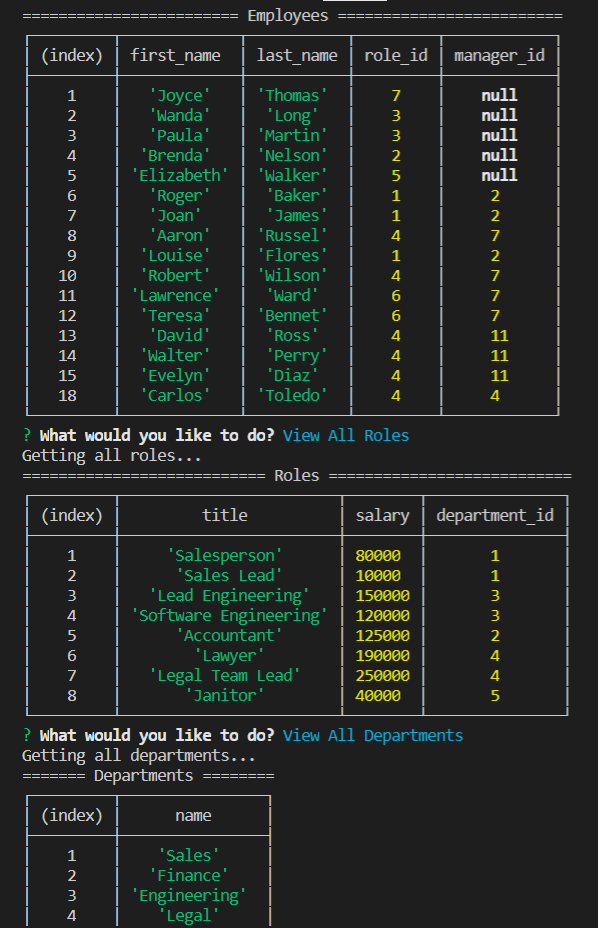
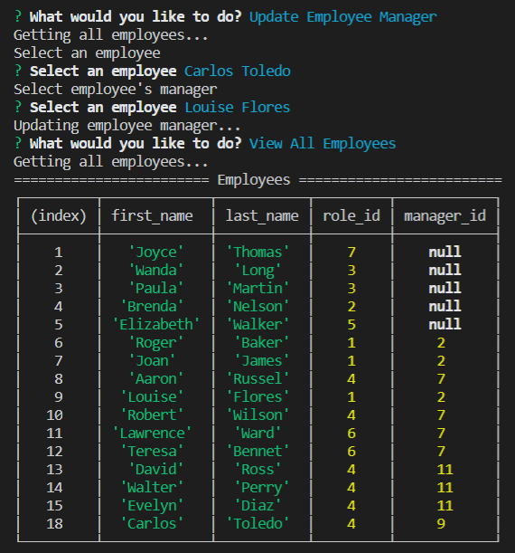
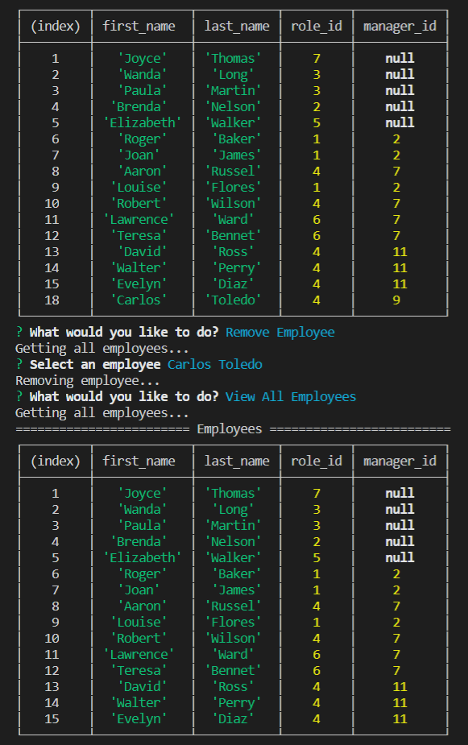

# Employee Tracker 👨‍💼👩‍💼 

</br>
<p align="center">
    
    
    
       
    
    
    
      
      
      
</p>

## Description

Keep track of your company's employees, roles, and departments. This console application will manage your data with a simple I/O interface.

## Table of Contents

* [Installation](#installation)
* [Usage](#usage)
    * [Screenshots](#screenshots)
    * [Snippets](#snippets)
* [Credits](#credits)
* [License](#license)


## Installation

Steps to run application:

    Command prompt:
    1. mysql -u root -p
    2. Enter password
    3. source db/schema.sql
    4. source d/seed.sql (optional)

    Git Bash
    1. git clone git@github.com:kqarlos/employee-tracker.git
    2. npm install
    3. add enviroment variable or update credentials in connection.js
    4. npm start


## Usage

### Screenshots

1. Displaying tables



2. Updating employee manager example



3. Removing employee example



4. Working app


### Snippets


1. Workflow to add employee

```javascript

//Calls to get employees and roles. calls to prompt for new employee's info
function addEmployee() {
    db.Employee.getEmployees().then(function (managers) {
        db.Role.getRoles().then(function (roles) {
            promptSelectRole(roles).then(function (roleid) {
                promptForEmployeeinfo(roleid, managers);
            });
        });
    });
}
    
```
* This function is called when a user selects to add a user. It handles the workflow and gathering of data necesary to ask the user for the new employee's information and eventually perform the mySQL query to add a new employee. It relies on promises that return a list of employees and a list of roles respectively. The list of roles is then used to ask the user for the new employee's role. This is then sent to _promptForEmployeeinfo(roleid, manager)_ This will make sure the user has the necessary information to populate the new user's properties.

2. Gets all employees from database

```javascript

    getEmployees(cb) {
        console.log("Getting all employees");
        this.connection.query("SELECT * FROM Employee", (err, res) => {
            if (err) throw err;
            cb(res);
        });
    }

```
* This function from the Employee class perform the query to retrieve all employees and call the callback function on the query response.

3. Asks user to select a role for the new employee

```javascript

function promptSelectRole(roles) {
    console.log("Select employee role...");
    return new Promise(function (resolve, reject) {
        if (!roles) return reject(Error("No roles found!"));
        let roleTitles = roles.map(r => {
            return (r.title);
        });
        inquirer.prompt({
            type: "list",
            name: "role",
            message: "Choose a role",
            choices: roleTitles
        }).then(function (res) {
            roles.forEach(r => {
                if (r.title === res.role) {
                    resolve(r.id);
                }
            });
        });
    });
}

```
* This function takes care of getting a role from the user. This encapsulates the process of getting a _roleid_ from the user which is used on other functions.

4. Prompts user to enter employee information

```javascript

//Ask user for information of the new employee to add
//Gets all roles titles to let the user choose new employee's role
//calls to query add employee
function promptForEmployeeinfo(roleid, managers) {
    console.log("Enter new employee's information");
    let managerNames = managers.map(m => {
        return (m.first_name + " " + m.last_name);
    });
    managerNames.push("No Manager");
    inquirer.prompt([
        {
            type: "input",
            message: "Enter first name: ",
            name: "firstName"
        },
        {
            type: "input",
            message: "Enter last name: ",
            name: "lastName"
        },
        {
            type: "list",
            message: "Select manager: ",
            name: "manager",
            choices: managerNames
        }
    ]).then(function (res) {
        var managerid;
        managers.forEach(m => {
            if ((m.first_name + " " + m.last_name) === res.manager) {
                managerid = m.id;
            }
        });
        db.Employee.addEmployee([
            res.firstName,
            res.lastName,
            roleid,
            managerid
        ], employee =>{
            mainMenu()
        );
    });

}

```
* This function prompts the user to enter or select information of the new employee. It uses the array of managers and maps only their  name. This allows the user to select the new employee's manager based on easier to understand properties. Then, the user's selection is mapped back to the original arrays to get the _managerid_. The user's input information, roleid and managerid is then used to call the database to _addEmployee()_ to the employee table.

4. Adds an employee to the database

```javascript

    addEmployee(employee, cb) {
        console.log("Adding employee...");
        this.connection.query("INSERT INTO employee(first_name, last_name, role_id, manager_id) VALUES (?, ?, ?, ?)", employee, (err, res) => {
            if (err) throw err;
            cb(res);
        });
    }

```
* This function recieves an array of employee information and a callback function. This array is used to insert a new employee into the _employees_ table. After the query is performed, the callback is called on the response.

## Credits

### Author

- 💼 Carlos Toledo: [portfolio](https://kqarlos.github.io/)
- :octocat: Github: [kqarlos](https://www.github.com/kqarlos)
- LinkedIn: [carlos-toledo415](https://www.linkedin.com/in/carlos-toledo415/)

### Built With

</br>
<p align="center">
    <a href="https://developer.mozilla.org/en-US/docs/Web/HTML"></a>
    <a href="https://developer.mozilla.org/en-US/docs/Web/CSS"></a>
    <a href="https://www.javascript.com/"></a>
    <a href="https://getbootstrap.com/"></a>
    <a href="https://nodejs.org/en/"></a>
    <a href="https://www.npmjs.com/package/express"></a>
    <a href="https://www.mysql.com/"></a>
</p>

## License

</br>
<p align="center">
    
</p>
